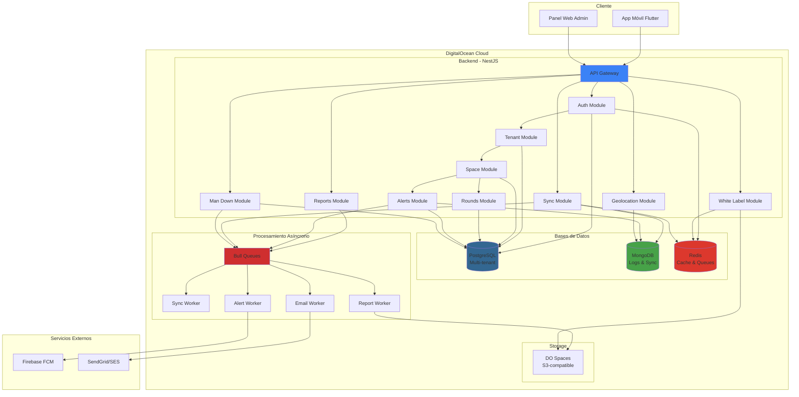
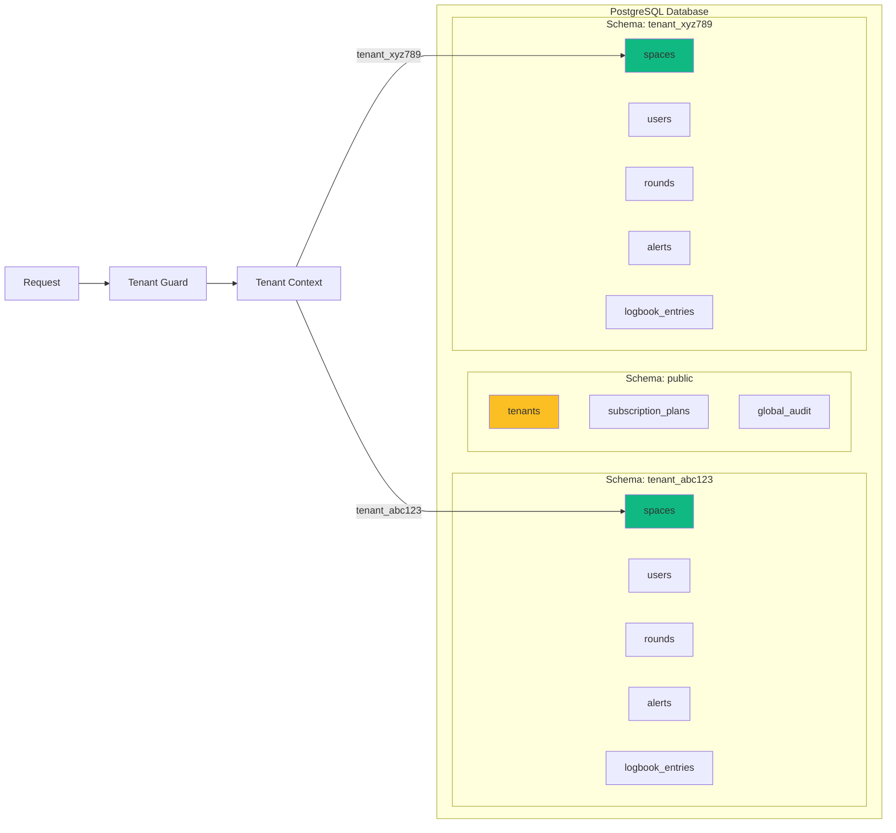
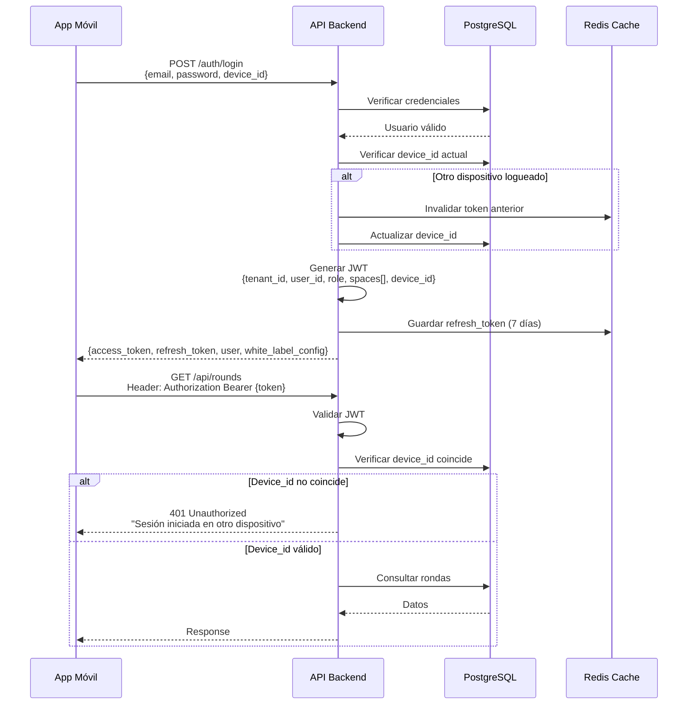
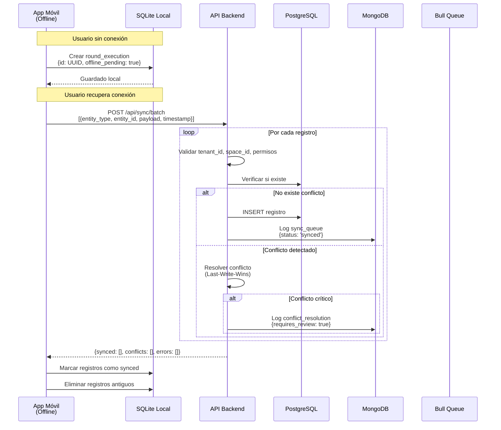
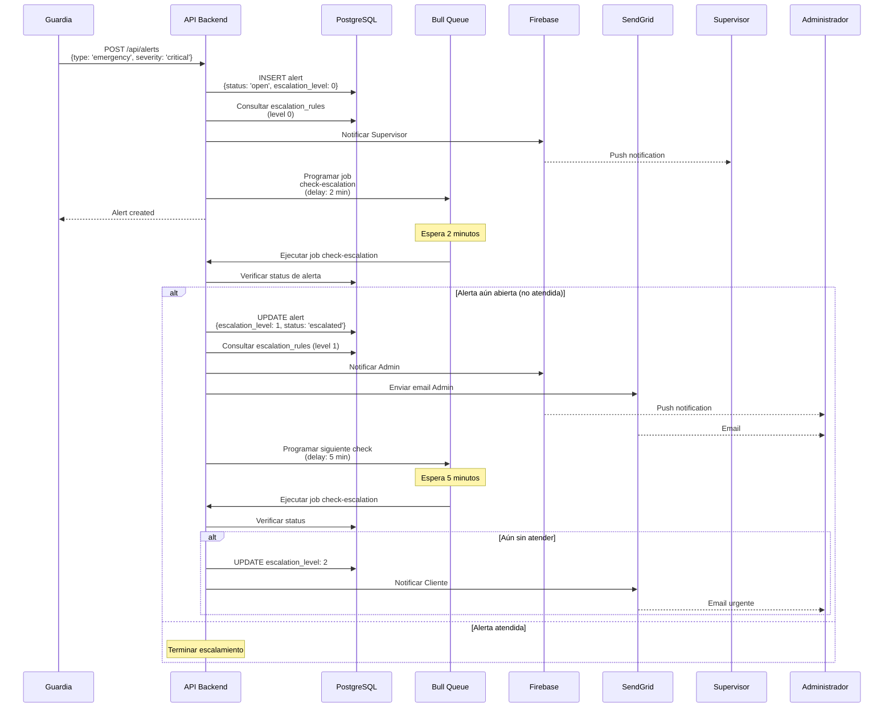
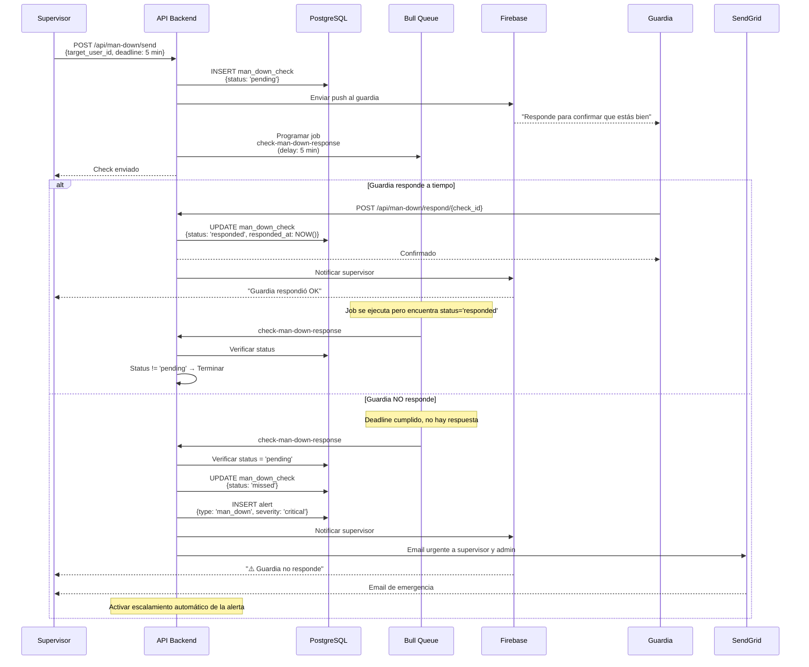
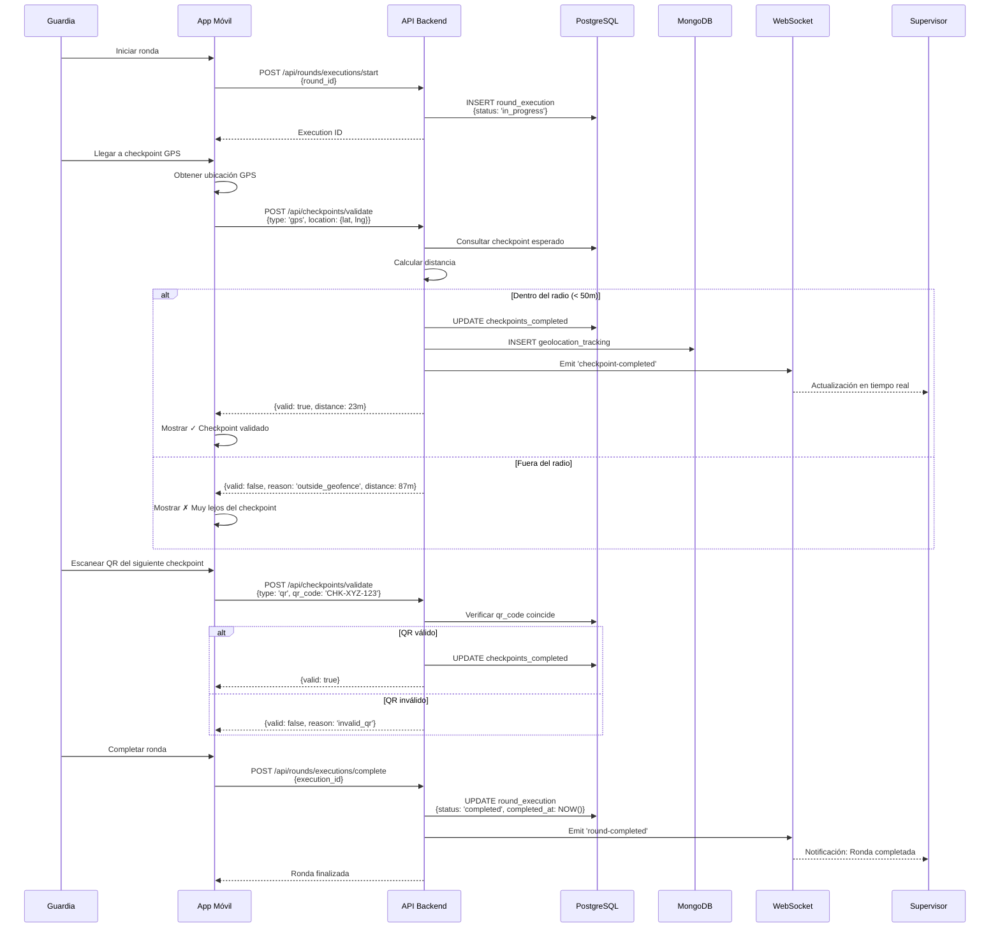
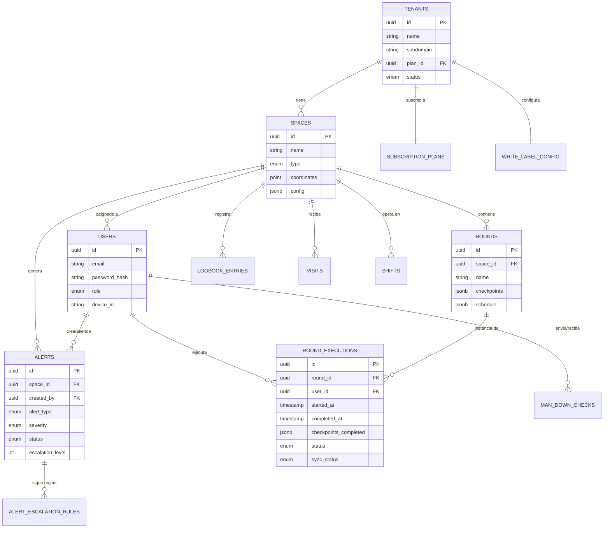
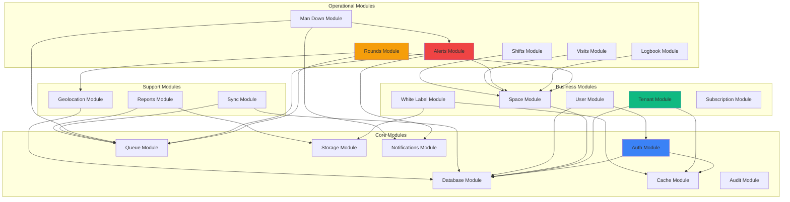

# Plan Arquitectónico Backend - Plataforma SaaS Multi-tenant de Gestión Operativa y Seguridad

Arquitectura backend completa para una plataforma SaaS multi-tenant con soporte offline-first, marca blanca dinámica, y gestión operativa de espacios físicos usando NestJS, PostgreSQL y MongoDB.

---

## 🎯 Stack Tecnológico

### Core
- **Framework**: NestJS (TypeScript)
- **Base de datos principal**: PostgreSQL (multi-tenant con schema isolation)
- **Base de datos auxiliar**: MongoDB (logs, auditoría, sincronización offline)
- **Cache**: Redis (sesiones, rate limiting, geolocalización en tiempo real)
- **Cola de mensajes**: Bull (BullMQ) con Redis (sincronización offline, reportes, emails)

### Servicios Externos
- **Notificaciones Push**: Firebase Cloud Messaging (FCM)
- **Email**: SendGrid o AWS SES
- **Storage**: DigitalOcean Spaces (S3-compatible) para logos, archivos, reportes
- **Geolocalización**: Integración con GPS nativo + validación backend

### Infraestructura
- **Cloud Provider**: DigitalOcean
- **Contenedores**: Docker + Docker Compose (desarrollo) / Kubernetes (producción)
- **CI/CD**: GitHub Actions
- **Monitoreo**: Prometheus + Grafana

---

## 📐 Diagramas de Arquitectura

### 1. Arquitectura General del Sistema



### 2. Flujo Multi-tenant (Schema Isolation)



### 3. Flujo de Autenticación y Sesión Única



### 4. Flujo de Sincronización Offline



### 5. Flujo de Escalamiento Automático de Alertas



### 6. Flujo Sistema "Hombre Vivo" (Man Down)



### 7. Flujo de Validación de Rondas (GPS/QR/NFC)



### 8. Modelo de Datos - Relaciones Principales



### 9. Arquitectura de Módulos NestJS



---

## 🏗️ Arquitectura General

### Patrón: Monolito Modular
- Módulos independientes por dominio
- Preparado para migración a microservicios si es necesario
- Comunicación entre módulos vía eventos internos (EventEmitter2)

### Estructura de Módulos

```
src/
├── core/                    # Módulos transversales
│   ├── auth/               # Autenticación y autorización
│   ├── database/           # Configuración PostgreSQL + MongoDB
│   ├── cache/              # Redis
│   ├── queue/              # Bull queues
│   ├── storage/            # DigitalOcean Spaces
│   ├── notifications/      # FCM + Email
│   └── audit/              # Sistema de auditoría
│
├── tenant/                 # Multi-tenancy
│   ├── tenant.module.ts
│   ├── tenant.service.ts
│   ├── tenant-context.ts   # Contexto del tenant actual
│   └── tenant.guard.ts     # Guard para aislar tenants
│
├── space/                  # Gestión de espacios
│   ├── space.module.ts
│   ├── space.service.ts
│   └── space-type.enum.ts
│
├── user/                   # Gestión de usuarios
│   ├── user.module.ts
│   ├── user.service.ts
│   └── role.enum.ts
│
├── white-label/            # Marca blanca
│   ├── white-label.module.ts
│   ├── white-label.service.ts
│   └── theme-config.entity.ts
│
├── operational/            # Módulos operativos
│   ├── rounds/            # Rondas/Recorridos
│   ├── logbook/           # Bitácora
│   ├── alerts/            # Alertas y escalamiento
│   ├── visits/            # Registro de visitas
│   ├── shifts/            # Turnos y entrega
│   └── man-down/          # Hombre vivo
│
├── sync/                   # Sincronización offline
│   ├── sync.module.ts
│   ├── sync-queue.service.ts
│   ├── conflict-resolver.service.ts
│   └── sync-log.entity.ts
│
├── reports/                # Generación de reportes
│   ├── reports.module.ts
│   ├── report-generator.service.ts
│   └── report-queue.processor.ts
│
├── subscription/           # Planes y monetización
│   ├── subscription.module.ts
│   ├── plan.entity.ts
│   └── feature-flag.service.ts
│
└── geolocation/           # GPS, QR, NFC
    ├── geolocation.module.ts
    ├── geofencing.service.ts
    └── checkpoint.service.ts
```

---

## 📊 Modelo de Datos (PostgreSQL)

### Estrategia Multi-tenant: Schema per Tenant
- Cada empresa (tenant) tiene su propio schema en PostgreSQL
- Schema `public` contiene tablas globales (tenants, subscriptions, global_audit)
- Aislamiento total de datos entre empresas
- Facilita backups y migraciones por tenant

### Entidades Principales

#### Schema: `public` (Global)

**tenants**
```sql
id: UUID (PK)
name: VARCHAR
subdomain: VARCHAR (unique) -- para marca blanca
plan_id: UUID (FK)
status: ENUM (active, suspended, cancelled)
created_at: TIMESTAMP
updated_at: TIMESTAMP
```

**subscription_plans**
```sql
id: UUID (PK)
name: VARCHAR
max_spaces: INTEGER
max_users: INTEGER
features: JSONB -- {offline: true, white_label: 'full', modules: [...]}
price: DECIMAL
billing_cycle: ENUM (monthly, yearly)
```

#### Schema: `tenant_{id}` (Por Tenant)

**spaces**
```sql
id: UUID (PK)
name: VARCHAR
type: ENUM (residential, hospital, industrial, logistics, construction, event)
address: TEXT
coordinates: POINT (PostGIS)
config: JSONB -- configuración específica del espacio
status: ENUM (active, inactive)
created_at: TIMESTAMP
updated_at: TIMESTAMP
deleted_at: TIMESTAMP (soft delete)
```

**users**
```sql
id: UUID (PK)
email: VARCHAR (unique)
password_hash: VARCHAR
full_name: VARCHAR
role: ENUM (operator, supervisor, admin, client)
phone: VARCHAR
status: ENUM (active, inactive, suspended)
device_id: VARCHAR (nullable) -- control de sesión única
session_token: VARCHAR (nullable)
last_login: TIMESTAMP
created_at: TIMESTAMP
updated_at: TIMESTAMP
deleted_at: TIMESTAMP
```

**user_space_assignments**
```sql
id: UUID (PK)
user_id: UUID (FK)
space_id: UUID (FK)
assigned_at: TIMESTAMP
assigned_by: UUID (FK users)
```

**rounds**
```sql
id: UUID (PK)
space_id: UUID (FK)
user_id: UUID (FK)
name: VARCHAR
checkpoints: JSONB -- [{id, name, type: 'gps|qr|nfc', location, order}]
schedule: JSONB -- {frequency, days, time_ranges}
status: ENUM (active, inactive)
created_at: TIMESTAMP
```

**round_executions**
```sql
id: UUID (PK)
round_id: UUID (FK)
user_id: UUID (FK)
space_id: UUID (FK)
started_at: TIMESTAMP
completed_at: TIMESTAMP (nullable)
checkpoints_completed: JSONB -- [{checkpoint_id, timestamp, location, photo_url, notes}]
status: ENUM (in_progress, completed, incomplete)
sync_status: ENUM (pending, synced, conflict)
device_id: VARCHAR
offline_created: BOOLEAN
created_at: TIMESTAMP
```

**logbook_entries**
```sql
id: UUID (PK)
space_id: UUID (FK)
user_id: UUID (FK)
entry_type: ENUM (incident, observation, maintenance, visitor, other)
description: TEXT
attachments: JSONB -- [{url, type, uploaded_at}]
location: POINT (PostGIS)
timestamp: TIMESTAMP
is_synced: BOOLEAN
is_immutable: BOOLEAN -- true después de sincronización
device_id: VARCHAR
created_at: TIMESTAMP
```

**alerts**
```sql
id: UUID (PK)
space_id: UUID (FK)
created_by: UUID (FK users)
alert_type: ENUM (emergency, security, maintenance, man_down, other)
severity: ENUM (low, medium, high, critical)
title: VARCHAR
description: TEXT
location: POINT (PostGIS)
status: ENUM (open, acknowledged, in_progress, resolved, escalated)
assigned_to: UUID (FK users, nullable)
escalation_level: INTEGER (default: 0)
escalated_at: TIMESTAMP (nullable)
resolved_at: TIMESTAMP (nullable)
created_at: TIMESTAMP
updated_at: TIMESTAMP
```

**alert_escalation_rules**
```sql
id: UUID (PK)
space_id: UUID (FK, nullable) -- null = regla global del tenant
alert_type: ENUM
severity: ENUM
level: INTEGER -- 0: supervisor, 1: regional, 2: admin, 3: client
wait_minutes: INTEGER -- tiempo de espera antes de escalar
notify_email: BOOLEAN
notify_push: BOOLEAN
```

**man_down_checks**
```sql
id: UUID (PK)
space_id: UUID (FK)
sent_by: UUID (FK users) -- supervisor que envía
sent_to: UUID (FK users) -- guardia que debe responder
sent_at: TIMESTAMP
response_deadline: TIMESTAMP
responded_at: TIMESTAMP (nullable)
status: ENUM (pending, responded, missed, escalated)
escalated_at: TIMESTAMP (nullable)
```

**visits**
```sql
id: UUID (PK)
space_id: UUID (FK)
visitor_name: VARCHAR
visitor_id_number: VARCHAR
visitor_company: VARCHAR (nullable)
host_name: VARCHAR
purpose: TEXT
entry_time: TIMESTAMP
exit_time: TIMESTAMP (nullable)
authorized_by: UUID (FK users)
status: ENUM (scheduled, in_progress, completed, cancelled)
created_at: TIMESTAMP
```

**shifts**
```sql
id: UUID (PK)
space_id: UUID (FK)
user_id: UUID (FK) -- guardia del turno
shift_start: TIMESTAMP
shift_end: TIMESTAMP (nullable)
status: ENUM (active, completed, pending_handover)
pending_tasks: JSONB -- [{task, status}]
handover_notes: TEXT (nullable)
handed_to: UUID (FK users, nullable)
created_at: TIMESTAMP
completed_at: TIMESTAMP (nullable)
```

**white_label_config**
```sql
id: UUID (PK)
tenant_id: UUID (unique) -- referencia al schema public
version: INTEGER
primary_color: VARCHAR
secondary_color: VARCHAR
logo_url: VARCHAR
app_name: VARCHAR
module_names: JSONB -- {rounds: 'Recorridos', alerts: 'Incidentes', ...}
icon_set: VARCHAR (default: 'material')
custom_icons: JSONB (nullable)
updated_at: TIMESTAMP
```

---

## 🗄️ Modelo de Datos (MongoDB)

### Colecciones

**sync_queue** (por tenant)
```javascript
{
  _id: ObjectId,
  tenant_id: UUID,
  space_id: UUID,
  user_id: UUID,
  device_id: String,
  entity_type: String, // 'round_execution', 'logbook_entry', 'alert'
  entity_id: UUID,
  operation: String, // 'create', 'update', 'delete'
  payload: Object,
  timestamp: Date,
  sync_status: String, // 'pending', 'processing', 'synced', 'failed', 'conflict'
  retry_count: Number,
  error_message: String,
  synced_at: Date,
  created_at: Date
}
```

**audit_logs** (global)
```javascript
{
  _id: ObjectId,
  tenant_id: UUID,
  space_id: UUID,
  user_id: UUID,
  action: String, // 'create', 'update', 'delete', 'login', 'logout'
  entity_type: String,
  entity_id: UUID,
  changes: Object, // {before: {}, after: {}}
  ip_address: String,
  user_agent: String,
  device_id: String,
  timestamp: Date
}
```

**geolocation_tracking** (por tenant)
```javascript
{
  _id: ObjectId,
  tenant_id: UUID,
  space_id: UUID,
  user_id: UUID,
  location: {
    type: "Point",
    coordinates: [longitude, latitude]
  },
  accuracy: Number,
  activity: String, // 'round', 'patrol', 'idle'
  timestamp: Date,
  ttl: Date // índice TTL para auto-eliminar después de 30 días
}
```

**conflict_resolution_log**
```javascript
{
  _id: ObjectId,
  tenant_id: UUID,
  space_id: UUID,
  entity_type: String,
  entity_id: UUID,
  conflict_type: String, // 'concurrent_edit', 'integrity_violation'
  conflicting_records: Array, // [{device_id, user_id, timestamp, payload}]
  resolution_strategy: String, // 'last_write_wins', 'manual_review'
  resolved_by: UUID,
  resolved_at: Date,
  created_at: Date
}
```

---

## 🔐 Autenticación y Autorización

### JWT Strategy
- **Access Token**: 15 minutos (corto por seguridad)
- **Refresh Token**: 7 días (almacenado en Redis)
- Payload: `{tenant_id, user_id, role, spaces: [], device_id}`

### Control de Sesión Única
1. Al hacer login, se genera `device_id` único
2. Se almacena en `users.device_id` y `users.session_token`
3. Cada request valida que el `device_id` del token coincida con el almacenado
4. Si otro dispositivo hace login, se invalida la sesión anterior
5. **Excepción**: Supervisores y Admins pueden tener múltiples sesiones

### Guards y Decorators

```typescript
@UseGuards(TenantGuard, RoleGuard, SpaceAccessGuard)
@Roles('supervisor', 'admin')
@RequireSpace() // valida que el usuario tenga acceso al space_id del request
```

### RBAC (Role-Based Access Control)

| Rol | Permisos |
|-----|----------|
| **Operator/Vigilante** | CRUD rondas propias, crear bitácora, crear alertas, responder man-down |
| **Supervisor** | Ver todas las rondas de sus espacios, gestionar alertas, enviar man-down, ver reportes |
| **Admin** | CRUD espacios, usuarios, configuración, marca blanca, ver todo |
| **Client** | Solo lectura de reportes y eventos de sus espacios |

---

## 🔄 Sistema de Sincronización Offline

### Flujo de Sincronización

#### 1. Operación Offline (App Móvil)
```
1. Usuario crea/edita registro (ej: round_execution)
2. Se guarda en SQLite local con flag offline_pending=true
3. Se genera UUID único en el cliente
4. Se incluye: tenant_id, space_id, user_id, device_id, timestamp
```

#### 2. Sincronización al Backend
```
1. App detecta conexión a internet
2. Envía batch de registros pendientes a POST /api/sync/batch
3. Backend procesa cada registro:
   a. Valida tenant_id, space_id, user_id
   b. Verifica permisos
   c. Detecta conflictos
   d. Inserta en PostgreSQL
   e. Registra en sync_queue (MongoDB) con status='synced'
4. Responde con: {synced: [], conflicts: [], errors: []}
```

#### 3. Resolución de Conflictos

**Estrategia: Last-Write-Wins con Validación de Integridad**

```typescript
// Pseudo-código
async resolveConflict(incomingRecord, existingRecord) {
  // Validar integridad crítica
  if (incomingRecord.entity_type === 'round_execution') {
    const sameRoundSameTime = await checkConcurrentExecution(
      incomingRecord.round_id,
      incomingRecord.started_at
    );
    
    if (sameRoundSameTime) {
      // Marcar para revisión manual
      await createConflictLog({
        type: 'concurrent_execution',
        records: [existingRecord, incomingRecord],
        resolution: 'manual_review'
      });
      return { status: 'conflict', requires_review: true };
    }
  }
  
  // Last-write-wins
  if (incomingRecord.timestamp > existingRecord.updated_at) {
    await updateRecord(incomingRecord);
    return { status: 'synced', strategy: 'last_write_wins' };
  }
  
  return { status: 'rejected', reason: 'stale_data' };
}
```

### Endpoints de Sincronización

```
POST /api/sync/batch
Body: {
  records: [
    {
      entity_type: 'round_execution',
      entity_id: UUID,
      operation: 'create',
      payload: {...},
      timestamp: ISO8601,
      device_id: String
    }
  ]
}

Response: {
  synced: [UUID],
  conflicts: [{entity_id, reason, requires_review}],
  errors: [{entity_id, error}]
}
```

---

## 🚨 Sistema de Alertas y Escalamiento Automático

### Configuración de Escalamiento

**Tabla**: `alert_escalation_rules`

Ejemplo de configuración:
```json
[
  {
    "alert_type": "emergency",
    "severity": "critical",
    "level": 0,
    "wait_minutes": 2,
    "notify_email": false,
    "notify_push": true,
    "escalate_to_role": "supervisor"
  },
  {
    "alert_type": "emergency",
    "severity": "critical",
    "level": 1,
    "wait_minutes": 5,
    "notify_email": true,
    "notify_push": true,
    "escalate_to_role": "admin"
  },
  {
    "alert_type": "emergency",
    "severity": "critical",
    "level": 2,
    "wait_minutes": 10,
    "notify_email": true,
    "notify_push": true,
    "escalate_to_role": "client"
  }
]
```

### Flujo de Escalamiento

```
1. Alerta creada → status='open', escalation_level=0
2. Notificar a supervisores del espacio (Push + Email opcional)
3. Iniciar job en Bull Queue: check_alert_escalation (delay: wait_minutes)
4. Job verifica:
   - Si status != 'open' → terminar (ya fue atendida)
   - Si status == 'open' → escalar
5. Escalar:
   - escalation_level++
   - status='escalated'
   - Notificar al siguiente nivel según reglas
   - Programar siguiente check
6. Repetir hasta nivel máximo o hasta que sea atendida
```

### Implementación con Bull Queue

```typescript
@Processor('alerts')
export class AlertEscalationProcessor {
  @Process('check-escalation')
  async handleEscalation(job: Job) {
    const { alert_id } = job.data;
    const alert = await this.alertService.findOne(alert_id);
    
    if (alert.status !== 'open') {
      return; // Ya fue atendida
    }
    
    const nextRule = await this.getNextEscalationRule(
      alert.alert_type,
      alert.severity,
      alert.escalation_level + 1
    );
    
    if (!nextRule) {
      return; // No hay más niveles
    }
    
    await this.alertService.escalate(alert_id, nextRule);
    
    // Programar siguiente check
    await this.alertQueue.add('check-escalation', 
      { alert_id },
      { delay: nextRule.wait_minutes * 60 * 1000 }
    );
  }
}
```

---

## 👤 Sistema "Hombre Vivo" (Man Down)

### Flujo

```
1. Supervisor envía check "hombre vivo" a guardia
   POST /api/man-down/send
   Body: {space_id, target_user_id, response_deadline_minutes: 5}

2. Se crea registro en man_down_checks con status='pending'

3. Se envía notificación push al guardia

4. Se programa job en Bull Queue: check_man_down_response

5. Guardia responde:
   POST /api/man-down/respond/{check_id}
   → status='responded', responded_at=NOW()

6. Si NO responde antes del deadline:
   Job ejecuta:
   - status='missed'
   - Crear alerta automática tipo 'man_down' con severity='critical'
   - Activar escalamiento automático de alertas
   - Enviar email al supervisor y admin
```

### Implementación

```typescript
@Injectable()
export class ManDownService {
  async sendCheck(dto: SendManDownDto) {
    const check = await this.manDownRepo.create({
      space_id: dto.space_id,
      sent_by: dto.supervisor_id,
      sent_to: dto.target_user_id,
      sent_at: new Date(),
      response_deadline: addMinutes(new Date(), dto.response_deadline_minutes),
      status: 'pending'
    });
    
    await this.notificationService.sendPush(dto.target_user_id, {
      title: 'Verificación de Seguridad',
      body: 'Responde para confirmar que estás bien',
      data: { type: 'man_down_check', check_id: check.id }
    });
    
    await this.queueService.add('check-man-down-response', 
      { check_id: check.id },
      { delay: dto.response_deadline_minutes * 60 * 1000 }
    );
    
    return check;
  }
  
  async respond(check_id: string, user_id: string) {
    const check = await this.manDownRepo.findOne(check_id);
    
    if (check.sent_to !== user_id) {
      throw new ForbiddenException();
    }
    
    if (check.status !== 'pending') {
      throw new BadRequestException('Check already processed');
    }
    
    await this.manDownRepo.update(check_id, {
      status: 'responded',
      responded_at: new Date()
    });
  }
}

@Processor('man-down')
export class ManDownProcessor {
  @Process('check-man-down-response')
  async handleMissedResponse(job: Job) {
    const { check_id } = job.data;
    const check = await this.manDownService.findOne(check_id);
    
    if (check.status !== 'pending') {
      return; // Ya respondió
    }
    
    // Marcar como perdido
    await this.manDownService.markAsMissed(check_id);
    
    // Crear alerta crítica
    const alert = await this.alertService.create({
      space_id: check.space_id,
      alert_type: 'man_down',
      severity: 'critical',
      title: 'Guardia no responde verificación',
      description: `${check.target_user.full_name} no respondió al check de seguridad`,
      created_by: check.sent_by
    });
    
    // Enviar email
    await this.emailService.send({
      to: [check.supervisor.email, ...admins],
      subject: '🚨 ALERTA: Guardia no responde',
      template: 'man-down-missed',
      data: { check, alert }
    });
  }
}
```

---

## 📍 Geolocalización y Validación de Rondas

### Tipos de Checkpoints

1. **GPS**: Validación por geofencing (radio de X metros)
2. **QR**: Escaneo de código QR único por checkpoint
3. **NFC**: Lectura de tag NFC

### Validación en Tiempo Real

```typescript
@Injectable()
export class CheckpointValidationService {
  async validateCheckpoint(dto: ValidateCheckpointDto) {
    const checkpoint = await this.checkpointRepo.findOne(dto.checkpoint_id);
    
    switch (checkpoint.type) {
      case 'gps':
        return this.validateGPS(checkpoint, dto.location);
      case 'qr':
        return this.validateQR(checkpoint, dto.qr_code);
      case 'nfc':
        return this.validateNFC(checkpoint, dto.nfc_tag_id);
    }
  }
  
  private async validateGPS(checkpoint, userLocation) {
    const distance = this.calculateDistance(
      checkpoint.location,
      userLocation
    );
    
    const maxRadius = checkpoint.config.radius || 50; // metros
    
    if (distance > maxRadius) {
      return {
        valid: false,
        reason: 'outside_geofence',
        distance
      };
    }
    
    // Guardar tracking en MongoDB
    await this.geolocationTracking.insert({
      user_id: dto.user_id,
      space_id: checkpoint.space_id,
      location: userLocation,
      activity: 'checkpoint_validation',
      timestamp: new Date()
    });
    
    return { valid: true, distance };
  }
}
```

### Tracking en Tiempo Real (WebSockets)

```typescript
@WebSocketGateway({ namespace: '/tracking' })
export class TrackingGateway {
  @SubscribeMessage('location-update')
  async handleLocationUpdate(
    @ConnectedSocket() client: Socket,
    @MessageBody() data: LocationUpdateDto
  ) {
    const { user_id, space_id, location } = data;
    
    // Guardar en MongoDB
    await this.geolocationService.saveLocation(user_id, space_id, location);
    
    // Emitir a supervisores del espacio
    this.server
      .to(`space:${space_id}:supervisors`)
      .emit('operator-location', {
        user_id,
        location,
        timestamp: new Date()
      });
  }
}
```

---

## 📊 Sistema de Reportes

### Tipos de Reportes

1. **Reporte de Rondas**: Rondas completadas/incompletas por espacio/período
2. **Reporte de Incidentes**: Alertas por tipo/severidad/espacio
3. **Reporte de Asistencia**: Turnos cumplidos por guardia
4. **Reporte de Visitas**: Registro de visitantes por espacio
5. **Reporte Personalizado**: Query builder para clientes premium

### Generación Asíncrona con Colas

```typescript
@Injectable()
export class ReportService {
  async generateReport(dto: GenerateReportDto) {
    const job = await this.reportQueue.add('generate-report', {
      tenant_id: dto.tenant_id,
      report_type: dto.report_type,
      space_ids: dto.space_ids,
      date_from: dto.date_from,
      date_to: dto.date_to,
      format: dto.format, // 'excel', 'pdf'
      requested_by: dto.user_id
    });
    
    return {
      job_id: job.id,
      status: 'processing',
      message: 'El reporte se enviará por email cuando esté listo'
    };
  }
}

@Processor('reports')
export class ReportProcessor {
  @Process('generate-report')
  async handleReportGeneration(job: Job) {
    const { tenant_id, report_type, ...params } = job.data;
    
    // Consultar datos
    const data = await this.queryReportData(report_type, params);
    
    // Generar Excel
    const buffer = await this.excelService.generate(data, report_type);
    
    // Subir a Storage
    const url = await this.storageService.upload(
      `reports/${tenant_id}/${job.id}.xlsx`,
      buffer
    );
    
    // Enviar email
    await this.emailService.send({
      to: params.requested_by_email,
      subject: `Reporte ${report_type} - ${format(new Date(), 'dd/MM/yyyy')}`,
      template: 'report-ready',
      attachments: [{ filename: 'reporte.xlsx', path: url }]
    });
    
    // El archivo se auto-elimina después de 7 días (lifecycle policy en DO Spaces)
  }
}
```

---

## 🎨 Marca Blanca (White Label)

### Configuración Dinámica

```typescript
@Injectable()
export class WhiteLabelService {
  async getConfig(tenant_id: string) {
    // Buscar en cache primero
    const cached = await this.cacheService.get(`white-label:${tenant_id}`);
    if (cached) return cached;
    
    // Consultar DB
    const config = await this.whiteLabelRepo.findOne({ tenant_id });
    
    // Cachear por 1 hora
    await this.cacheService.set(`white-label:${tenant_id}`, config, 3600);
    
    return config;
  }
  
  async updateConfig(tenant_id: string, dto: UpdateWhiteLabelDto) {
    // Incrementar versión
    const current = await this.getConfig(tenant_id);
    const newVersion = current.version + 1;
    
    await this.whiteLabelRepo.update(tenant_id, {
      ...dto,
      version: newVersion,
      updated_at: new Date()
    });
    
    // Invalidar cache
    await this.cacheService.del(`white-label:${tenant_id}`);
    
    // Notificar a apps móviles que hay nueva versión
    await this.notificationService.sendToTenant(tenant_id, {
      type: 'white_label_update',
      version: newVersion
    });
  }
}
```

### Endpoint para App Móvil

```
GET /api/white-label
Headers: Authorization: Bearer {token}

Response: {
  version: 2,
  primary_color: "#1E40AF",
  secondary_color: "#10B981",
  logo_url: "https://spaces.do/tenant-123/logo.png",
  app_name: "MiSeguridad Pro",
  module_names: {
    rounds: "Recorridos",
    alerts: "Incidentes",
    logbook: "Bitácora",
    visits: "Visitas",
    shifts: "Turnos"
  },
  icon_set: "material",
  custom_icons: null
}
```

---

## 🔒 Seguridad y Auditoría

### Auditoría Automática

Interceptor global que registra todas las operaciones:

```typescript
@Injectable()
export class AuditInterceptor implements NestInterceptor {
  intercept(context: ExecutionContext, next: CallHandler): Observable<any> {
    const request = context.switchToHttp().getRequest();
    const { user, body, method, url } = request;
    
    return next.handle().pipe(
      tap(async (response) => {
        if (method !== 'GET') {
          await this.auditService.log({
            tenant_id: user.tenant_id,
            user_id: user.id,
            action: method,
            entity_type: this.extractEntityType(url),
            entity_id: response?.id,
            changes: { before: null, after: body },
            ip_address: request.ip,
            user_agent: request.headers['user-agent'],
            timestamp: new Date()
          });
        }
      })
    );
  }
}
```

### Soft Delete Global

```typescript
@Injectable()
export class SoftDeleteInterceptor implements NestInterceptor {
  intercept(context: ExecutionContext, next: CallHandler): Observable<any> {
    const request = context.switchToHttp().getRequest();
    
    if (request.method === 'DELETE') {
      // Convertir DELETE a UPDATE con deleted_at
      request.method = 'PATCH';
      request.body = { deleted_at: new Date() };
    }
    
    return next.handle();
  }
}
```

---

## 📦 Planes y Feature Flags

### Validación de Features

```typescript
@Injectable()
export class FeatureFlagService {
  async canUseFeature(tenant_id: string, feature: string): Promise<boolean> {
    const subscription = await this.subscriptionService.getByTenant(tenant_id);
    const plan = await this.planService.findOne(subscription.plan_id);
    
    return plan.features[feature] === true;
  }
}

// Decorator
export const RequireFeature = (feature: string) => {
  return applyDecorators(
    UseGuards(FeatureFlagGuard),
    SetMetadata('feature', feature)
  );
};

// Uso
@Post('rounds')
@RequireFeature('offline')
async createRound() {
  // Solo si el plan incluye 'offline'
}
```

### Límites por Plan

```typescript
@Injectable()
export class PlanLimitGuard implements CanActivate {
  async canActivate(context: ExecutionContext): Promise<boolean> {
    const request = context.getRequest();
    const { tenant_id } = request.user;
    
    const subscription = await this.subscriptionService.getByTenant(tenant_id);
    const plan = await this.planService.findOne(subscription.plan_id);
    
    // Ejemplo: validar número de espacios
    const spaceCount = await this.spaceService.countByTenant(tenant_id);
    
    if (spaceCount >= plan.max_spaces) {
      throw new ForbiddenException('Plan limit reached: max spaces');
    }
    
    return true;
  }
}
```

---

## 🚀 Fases de Implementación

### Fase 1: Fundación (Semanas 1-3)
- ✅ Setup inicial: NestJS + PostgreSQL + MongoDB + Redis
- ✅ Configuración Docker + Docker Compose
- ✅ Multi-tenancy: Schema per tenant
- ✅ Autenticación: JWT + Guards
- ✅ Módulo User + Role
- ✅ Módulo Tenant + Subscription
- ✅ Auditoría básica

### Fase 2: Core Operativo (Semanas 4-6)
- ✅ Módulo Space
- ✅ Módulo Rounds (CRUD + Checkpoints)
- ✅ Módulo Logbook
- ✅ Módulo Alerts (sin escalamiento aún)
- ✅ Geolocalización: GPS validation
- ✅ Sistema de sincronización offline básico

### Fase 3: Features Avanzadas (Semanas 7-9)
- ✅ Escalamiento automático de alertas
- ✅ Sistema "Hombre Vivo"
- ✅ Módulo Visits
- ✅ Módulo Shifts
- ✅ QR/NFC validation
- ✅ WebSockets para tracking en tiempo real
- ✅ Resolución de conflictos offline

### Fase 4: Marca Blanca y Reportes (Semanas 10-11)
- ✅ Módulo White Label
- ✅ Sistema de reportes con colas
- ✅ Generación de Excel
- ✅ Envío por email
- ✅ Storage en DigitalOcean Spaces

### Fase 5: Notificaciones y Optimización (Semanas 12-13)
- ✅ Integración Firebase FCM
- ✅ Email con SendGrid
- ✅ Optimización de queries
- ✅ Índices en PostgreSQL y MongoDB
- ✅ Rate limiting
- ✅ Caching estratégico

### Fase 6: Testing y Deploy (Semanas 14-15)
- ✅ Tests unitarios (>70% coverage)
- ✅ Tests E2E
- ✅ CI/CD con GitHub Actions
- ✅ Deploy a DigitalOcean
- ✅ Monitoreo con Prometheus + Grafana
- ✅ Documentación API (Swagger)

---

## 📚 Dependencias Principales

```json
{
  "dependencies": {
    "@nestjs/common": "^11.0.0",
    "@nestjs/core": "^11.0.0",
    "@nestjs/typeorm": "^10.0.0",
    "@nestjs/mongoose": "^10.0.0",
    "@nestjs/jwt": "^10.0.0",
    "@nestjs/passport": "^10.0.0",
    "@nestjs/bull": "^10.0.0",
    "@nestjs/websockets": "^11.0.0",
    "@nestjs/platform-socket.io": "^11.0.0",
    "typeorm": "^0.3.0",
    "pg": "^8.11.0",
    "mongoose": "^8.0.0",
    "bull": "^4.12.0",
    "redis": "^4.6.0",
    "passport-jwt": "^4.0.0",
    "bcrypt": "^5.1.0",
    "class-validator": "^0.14.0",
    "class-transformer": "^0.5.0",
    "exceljs": "^4.4.0",
    "firebase-admin": "^12.0.0",
    "@sendgrid/mail": "^8.0.0",
    "aws-sdk": "^2.1500.0",
    "geolib": "^3.3.0",
    "uuid": "^9.0.0"
  }
}
```

---

## 🎯 Métricas de Éxito

### Performance
- Tiempo de respuesta API: < 200ms (p95)
- Sincronización offline: < 5s para 100 registros
- Generación de reportes: < 30s para 10k registros

### Escalabilidad
- Soportar 1000 tenants simultáneos
- 10,000 usuarios activos concurrentes
- 100,000 sincronizaciones/día

### Disponibilidad
- Uptime: 99.9%
- RTO (Recovery Time Objective): < 1 hora
- RPO (Recovery Point Objective): < 5 minutos

---

## 📝 Notas Finales

### Decisiones Arquitectónicas Clave

1. **Schema per Tenant**: Mejor aislamiento y performance que row-level security
2. **MongoDB para Logs**: Mejor para datos no estructurados y alto volumen de escritura
3. **Bull Queues**: Procesamiento asíncrono confiable con retry automático
4. **Redis Cache**: Reduce carga en DB para configuraciones frecuentes (white label, permisos)
5. **Soft Delete**: Cumple con auditoría y permite recuperación de datos

### Consideraciones Futuras

- **Microservicios**: Si crece mucho, separar módulos críticos (sync, reports, notifications)
- **Multi-región**: Replicación de DB en múltiples regiones de LATAM
- **GraphQL**: Para queries complejas en reportes personalizados
- **Machine Learning**: Detección de anomalías en rondas y alertas

---

**Próximos Pasos**: Revisar y aprobar este plan. Una vez confirmado, comenzaremos con la Fase 1: Fundación.
